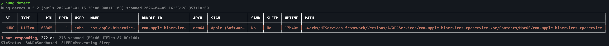
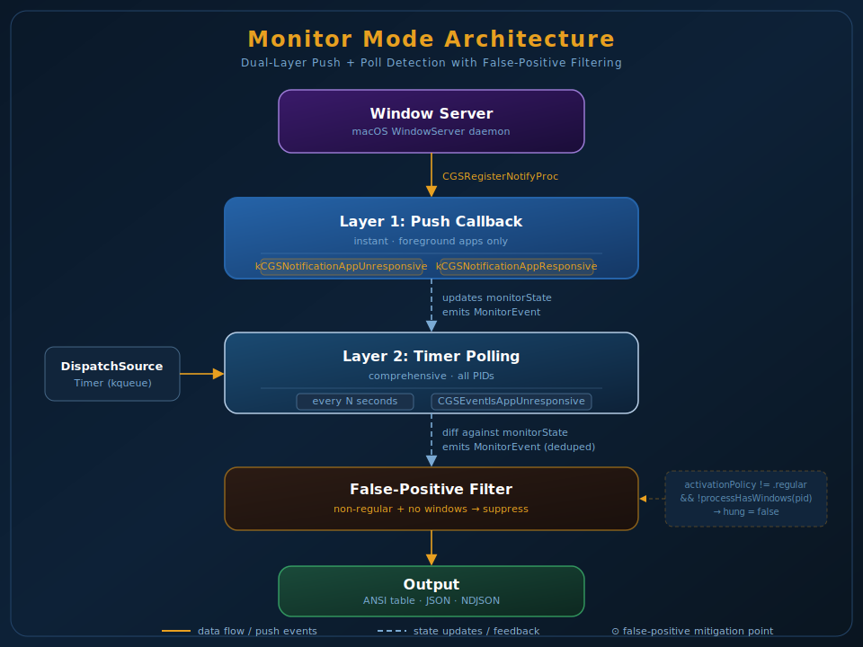

# hung_detect 🔍 — macOS "Not Responding" Detector

[🇺🇸 English](./README.md) | [🇨🇳 简体中文](./README.zh-CN.md)

[](https://github.com/fjh658/hung_detect)
[](https://github.com/fjh658/homebrew-tap)
[](LICENSE)

Detect "Not Responding" processes using the same Window Server API as Activity Monitor. One command, instant results.

<p align="left">
  
</p>

## Install

```bash
brew tap fjh658/tap
brew install hung-detect
```

Or build from source: `make build` (requires Xcode CLI tools)

## Quick Start

```bash
hung_detect                    # Find hung processes (exit 1 if any found)
hung_detect -l                 # List all processes with status
hung_detect --pid 913          # Check specific PID
hung_detect --name Safari      # Check by name
hung_detect -m                 # Monitor mode: watch for state changes
hung_detect --sample           # Auto-sample hung processes
hung_detect -m --sample        # Monitor + auto-sample on hung
```

## Features

- **Same API as Activity Monitor** — uses `CGSEventIsAppUnresponsive` via SkyLight/LaunchServices private APIs. Detects all LS-registered process types (Foreground, UIElement, BackgroundOnly).
- **Monitor mode** — continuous push+poll detection with NDJSON event stream. Push via `CGSRegisterNotifyProc`, poll as fallback.
- **Built-in diagnosis** — automatically run `/usr/bin/sample` and `/usr/sbin/spindump` on hung processes. System-wide spindump with `--full`.
- **MCP server** — stdio JSON-RPC server for AI tool integration. One command installs to 14 AI clients (Claude, Codex, Cursor, etc.).
- **Rich metadata** — PID, PPID, user, bundle ID, arch, code signing authority, sandbox state, sleep assertions, uptime, SHA-256.
- **Fast** — `proc_listpids` (162x lighter than sysctl), LS info cached by PID lifetime, single sysctl per process, CGS functions linked at compile time.
- **Universal binary** — `arm64` + `x86_64`, macOS 12+.

## Usage

```bash
# Detection
hung_detect                              # Detect hung processes (exit 1 if any)
hung_detect -l                           # List all LS-registered processes
hung_detect --type foreground -l         # Only Dock apps
hung_detect --type gui -l                # Dock + menu bar apps
hung_detect --json                       # Machine-readable JSON output
hung_detect --pid 1                      # Check any PID (including non-LS)
hung_detect --name Chrome                # Search by name or bundle ID

# Monitor mode
hung_detect -m                           # Watch for hung state changes
hung_detect -m --json | jq .             # Stream events as NDJSON
hung_detect -m --name Safari --interval 2  # Monitor Safari every 2s

# Diagnosis (auto-sample/spindump hung processes)
hung_detect --sample                     # sample on hung
hung_detect -m --sample                  # Monitor + auto-sample on hung
sudo hung_detect -m --full               # Monitor + full auto-diagnose
sudo hung_detect --full --spindump-duration 5  # Full diagnosis with 5s capture

# MCP server (AI integration)
hung_detect --mcp-install                # Auto-install to 14 AI clients
hung_detect --mcp                        # Start MCP server
```

## 🤖 MCP Server (AI Integration)

hung_detect includes a built-in [MCP](https://modelcontextprotocol.io/) (Model Context Protocol) server, allowing AI assistants to detect and monitor Not Responding processes in real time.

### Quick Setup

```bash
# Auto-install to all detected AI clients (Claude, Codex, Claude Code, Cursor, Windsurf, etc.)
hung_detect --mcp-install

# Or print config JSON for manual setup
hung_detect --mcp-config

# Remove from all clients
hung_detect --mcp-uninstall
```

`--mcp-install` detects and configures: Claude Desktop, Codex, Claude Code, Cursor, Windsurf, Cline, Roo Code, Kilo Code, LM Studio, Gemini CLI, BoltAI, Warp, Amazon Q, VS Code.

### Tools

The MCP server exposes 5 tools over stdio (JSON-RPC 2.0):

| Tool            | Description                                                                         |
| --------------- | ----------------------------------------------------------------------------------- |
| `scan`          | Scan all LS-known processes. Options: `list`, `show_sha`, `foreground_only`, `type` |
| `check_pid`     | Check a specific PID for hung status                                                |
| `check_name`    | Find processes by name or bundle ID (case-insensitive substring)                    |
| `start_monitor` | Start background monitoring with push notifications on state changes                |
| `stop_monitor`  | Stop background monitoring                                                          |

### Monitor Notifications

When monitoring is active, the server pushes `notifications/message` (MCP logging) on state transitions:

- **`became_hung`** (level: `alert`) — a process stopped responding
- **`became_responsive`** (level: `info`) — a previously hung process recovered
- **`process_exited`** (level: `info`) — a monitored process terminated

### Architecture

- **Transport**: stdio (stdin/stdout), no network ports exposed
- **Lifecycle**: AI client spawns `hung_detect --mcp` as a subprocess; process exits cleanly when stdin closes
- **Threading**: stdin reader on background thread, main thread runs CFRunLoop for timers and AppKit, stdout serialized via lock
- **Multi-instance**: safe — `CGSEventIsAppUnresponsive` is read-only, no contention

### Manual Usage

```bash
# Start MCP server (used by AI clients, not typically run directly)
hung_detect --mcp
```

## 📊 Output Examples

<details>
<summary>JSON output</summary>

```json
{
  "version": "0.5.2",
  "summary": { "total": 1, "not_responding": 1, "ok": 0 },
  "processes": [{
    "pid": 913, "name": "AlDente", "responding": false,
    "bundle_id": "com.apphousekitchen.aldente-pro-setapp",
    "arch": "arm64", "codesign_authority": "Developer ID Application: ...",
    "sandboxed": false, "elapsed_seconds": 29033, "app_type": "Foreground"
  }]
}
```

</details>

<details>
<summary>Monitor architecture</summary>



</details>

## ⚙️ CLI Options

**Detection:**

- `--list`, `-l`: list all matched processes (default shows only not responding).
- `--sha`: include SHA-256 column in table output.
- `--type <TYPE>`: process type — `foreground`, `uielement`, `gui`, `background`, `lsapp` (default: `lsapp`).
- `--foreground-only`: alias for `--type foreground`.
- `--pid <PID>`: filter by PID (repeatable).
- `--name <NAME>`: filter by app name or bundle ID (repeatable).
- `--json`: JSON output (always includes `sha256` field).
- `--no-color`: disable ANSI colors.
- `-v`, `--version`: show version.
- `-h`, `--help`: show help.

**MCP Server:**

- `--mcp`: run as MCP server over stdio (JSON-RPC 2.0).
- `--mcp-config`: print MCP server configuration JSON.
- `--mcp-install`: install MCP config to all detected AI clients.
- `--mcp-uninstall`: remove MCP config from all detected AI clients.

**Monitor:**

- `--monitor`, `-m`: continuous monitoring mode (Ctrl+C to stop).
- `--interval <SECS>`: polling interval for monitor mode (default: 3, min: 0.5).

**Diagnosis:**

- `--sample`: run `sample` on each hung process.
- `--spindump`: also run per-process spindump (implies `--sample`, needs root).
- `--full`: also run system-wide spindump (implies `--spindump`, needs root).
- Scope: diagnosis options apply in both single-shot and monitor (`-m`) modes.
- Strict mode: `--spindump` / `--full` fail fast at startup if spindump privilege is unavailable.
- Sudo ownership: when run via `sudo`, output directory/files are chowned back to the real user (no root-owned dump artifacts).
- `--duration <SECS>`: legacy shortcut to set all diagnosis durations at once.
- `--sample-duration <SECS>`: `sample` duration in seconds (default: 10, min: 1).
- `--sample-interval-ms <MS>`: `sample` interval in milliseconds (default: 1, min: 1).
- `--spindump-duration <SECS>`: per-process `spindump` duration in seconds (default: 10, min: 1).
- `--spindump-interval-ms <MS>`: per-process `spindump` interval in milliseconds (default: 10, min: 1).
- `--spindump-system-duration <SECS>`: system-wide `spindump` duration for `--full` (default: 10, min: 1).
- `--spindump-system-interval-ms <MS>`: system-wide `spindump` interval for `--full` (default: 10, min: 1).
- `--outdir <DIR>`: output directory (default: `./hung_diag_<timestamp>`).

## 📌 Exit Codes

- `0`: all scanned/matched processes are responding.
- `1`: at least one process is not responding.
- `2`: argument/runtime error.

## 🔒 Private API Notes

This tool uses private macOS APIs:

- **CGS functions** (`CGSMainConnectionID`, `CGSEventIsAppUnresponsive`, `CGSRegisterNotifyProc`) — called directly via [CGSInternal](https://github.com/nickhutchinson/CGSInternal) headers. Linked at compile time.
- **LS functions** (`_LSASNCreateWithPid`, `_LSASNExtractHighAndLowParts`, `_LSCopyApplicationInformation`) — resolved at runtime via `dlsym` with underscore-variant fallbacks. No public headers exist.

If required symbols cannot be resolved, the program exits with code `2`.

## 🔎 hung_detect vs Activity Monitor

| Dimension                   | Activity Monitor                            | hung_detect                                                        | Status                 |
| --------------------------- | ------------------------------------------- | ------------------------------------------------------------------ | ---------------------- |
| Hung signal source          | Window Server private signal                | Same CGS signal path (`CGSEventIsAppUnresponsive`)                 | Aligned                |
| Hung detection scope        | `knownToLaunchServices` only                | Same — only LS-registered processes checked                        | Aligned                |
| Monitor mechanism           | push + poll                                 | push + poll, fallback to poll-only when push unavailable           | Aligned                |
| Startup push gap handling   | fast convergence via internal state refresh | unknown PID push triggers immediate rescan                         | Aligned                |
| Push callback scope         | foreground app type                         | push update applies to foreground app type                         | Aligned                |
| Default scan scope          | app-centric                                 | all LaunchServices-known processes by default (`--type` to filter) | Extended               |
| Output form                 | GUI only                                    | table + JSON + NDJSON monitor stream                               | Extended               |
| Diagnosis capture           | mostly manual workflow                      | built-in `sample` / `spindump` / `--full`                          | Extended               |
| Spindump privilege behavior | internal app flow                           | strict fail-fast for `--spindump` / `--full`                       | Intentional difference |
| Sudo artifact ownership     | N/A                                         | chown outputs back to invoking user                                | Extended               |
| Automation integration      | limited                                     | stable CLI exit codes + scriptable flags                           | Extended               |
| AI tool integration         | N/A                                         | built-in MCP server with scan, monitor, and push notifications     | Extended               |

## 🧵 Concurrency Model

- `MonitorEngine` state is confined to the main queue (`CFRunLoopRun` + main-queue callback handoff).
- The monitor event loop uses `CFRunLoopRun()` (not `dispatchMain()`) so that CGS push notifications and GCD timer ticks are processed on the main run loop.
- Push callbacks (`CGSRegisterNotifyProc`) and polling both update the same main-thread state map to avoid races.
- Unknown/early push PID events schedule an immediate reconcile rescan instead of waiting for the next polling tick.
- Diagnosis work runs on a dedicated concurrent queue, with per-PID dedup guarded by a small lock.
- CGS symbol resolution is one-time and immutable after load, so runtime reads do not need mutable shared state.

## ⚡ Performance Notes

- SHA-256 and code signing authority are computed lazily for rows that are actually emitted.
- Code signing uses a two-pass approach: a fast flag check identifies ad-hoc/unsigned binaries without certificate extraction; only properly signed binaries pay the cost of `SecCodeCopySigningInformation` with `kSecCSSigningInformation`.
- Both SHA-256 and code signing results are cached by executable path within a single run (NSCache), avoiding redundant lookups when multiple processes share the same binary (e.g. 326 processes → 152 unique paths → 174 cache hits).
- `--json --list` can be noticeably slower than default mode because it emits and hashes every matched process.

Benchmark (326 processes, 152 unique paths):

| Mode                   | Wall time    |
| ---------------------- | ------------ |
| Default (hung only)    | ~0.1s        |
| `--name <APP>`         | ~0.09s       |
| `--list` with cache    | ~1.2s        |
| `--list` without cache | ~1.4s (+12%) |

## 🩺 Diagnosis

Diagnosis functionality is built into `hung_detect`. When hung processes are found, it can automatically collect `sample` and `spindump` data in parallel.

### Three Diagnosis Levels

| Level | Flag         | Tools                    | Requires root |
| ----- | ------------ | ------------------------ | ------------- |
| 1     | `--sample`   | per-process `sample`     | No            |
| 2     | `--spindump` | + per-process `spindump` | Yes           |
| 3     | `--full`     | + system-wide `spindump` | Yes           |

### Output Files

Saved to `hung_diag_<timestamp>/` (or `--outdir`) with timestamped filenames:

```
hung_diag_20260214_142312/
├── 20260214_142312_AlDente_913.sample.txt
├── 20260214_142312_AlDente_913.spindump.txt
└── 20260214_142312_system.spindump.txt
```

### Monitor + Diagnosis

Diagnosis integrates with monitor mode — when a process becomes hung, diagnosis triggers automatically:

```bash
./hung_detect -m --sample                 # Auto-sample on hung
sudo ./hung_detect -m --full              # Full auto-diagnosis
sudo ./hung_detect -m --full --spindump-duration 5 --spindump-system-duration 5  # Full auto-diagnosis with 5s spindumps
./hung_detect -m --sample --json | jq .   # Stream diagnosis events as NDJSON
```

### Trigger Logic (Monitor Mode)

- Diagnosis is triggered on transition to hung (`responding -> not responding`), not on every poll tick.
- On monitor startup, processes that are already hung trigger one diagnosis round immediately.
- If a process stays hung, it will not retrigger until it becomes responsive and hangs again.
- Per-process diagnosis (`sample` / per-PID `spindump`) is deduplicated while a PID is already being diagnosed.
- With `--full`, each hung trigger also starts one system-wide `spindump`; this can still run even when per-PID work is deduplicated.

Examples:

- `responding -> not responding`:
  - `--sample`: 1 `sample`
  - `--sample --spindump`: 1 `sample` + 1 per-PID `spindump`
  - `--full`: 1 `sample` + 1 per-PID `spindump` + 1 system-wide `spindump`
- `responding -> not responding -> responding -> not responding`:
  - usually two diagnosis rounds
  - if the second hang happens before the first round for the same PID finishes, per-PID tools may be skipped by dedup

## 📄 License

Apache License 2.0. See `LICENSE`.
