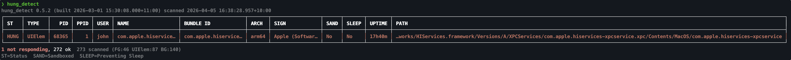
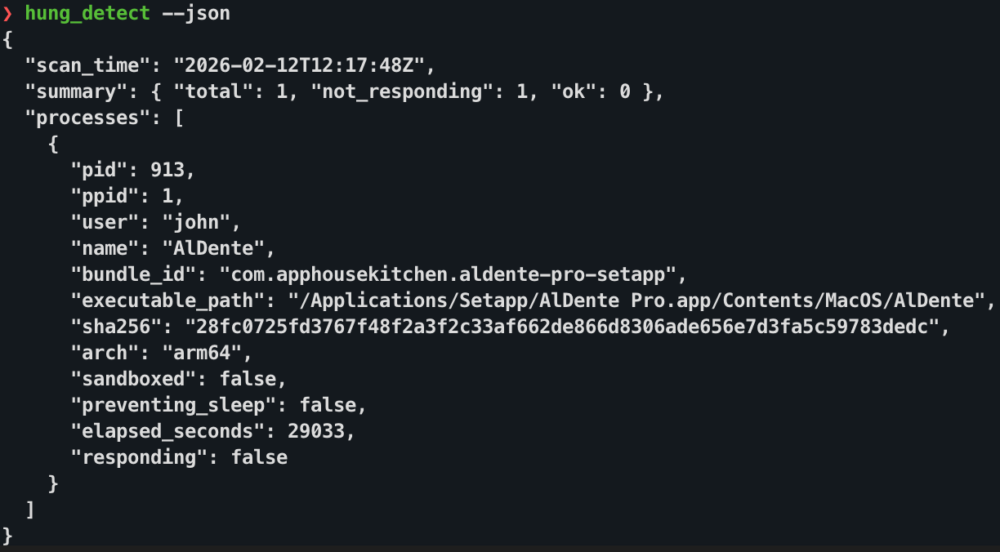

# hung_detect 🔍

[🇺🇸 English](./README.md) | [🇨🇳 简体中文](./README.zh-CN.md)

`hung_detect` 是一个用 Swift 实现的 macOS GUI 进程“未响应”检测工具。
它使用与活动监视器一致的私有 Window Server 信号（`CGSEventIsAppUnresponsive`）。

## ✨ 功能

- 用活动监视器风格的信号判断 GUI 应用是否未响应。
- 支持通用二进制构建（`arm64` + `x86_64`）。
- 最低系统版本由 `Package.swift` 定义（`macOS 12+`）。
- 支持终端表格输出和 JSON 输出。
- 输出进程元信息：PID、父 PID、用户、Bundle ID、架构、沙盒状态、防睡眠状态、运行时长、可执行文件路径。
- 可选显示 SHA-256。
- **监控模式**：持续 push+poll 监听 hung 状态变化（NDJSON 事件流）。
- **内置诊断**：自动对 hung 进程执行 `sample` 和 `spindump`。

## 🧰 环境要求

- macOS
- Xcode 命令行工具（`swift`、`xcrun`）

## 🏗️ 构建

构建通用二进制：

```bash
make build
```

检查产物架构和 `minos`：

```bash
make check
```

兼容脚本入口（内部会转调 Makefile）：

```bash
./build_hung_detect.sh
```

## 🍺 Homebrew Tap 安装

Homebrew 安装会直接使用 `dist/` 中的预编译二进制包，不在用户机器上编译。

本地把当前仓库作为 tap：

```bash
brew tap fjh658/hung-detect /path/to/hung_detect
brew install hung-detect
```

从 GitHub tap 安装：

```bash
brew tap fjh658/hung-detect https://github.com/fjh658/hung_detect.git
brew install hung-detect
```

发布前更新预编译包：

```bash
make package
```

`make package` 还会基于 `Formula/hung-detect.rb.tmpl` 自动刷新 `Formula/hung-detect.rb`，并注入当前版本（来自 `Sources/hung_detect/Version.swift`）与 tarball 的 `sha256`。

## 🚀 使用示例

```bash
./hung_detect                             # 检测 hung 应用（有则 exit 1）
./hung_detect --all                       # 列出所有 GUI 应用详情
./hung_detect --json                      # 机器可读 JSON 输出
./hung_detect --name Chrome               # 显示 Chrome 进程
./hung_detect --pid 913                   # 显示指定 PID

# 监控模式
./hung_detect --monitor                   # 监听 hung 状态变化
./hung_detect -m --json | jq .            # 以 NDJSON 流输出事件
./hung_detect -m --name Safari --interval 2  # 每 2 秒监控 Safari

# 诊断
./hung_detect --sample                    # 检测 + 对 hung 进程采样
sudo ./hung_detect --full --spindump-duration 5 --spindump-system-duration 5  # 完整诊断（spindump 5 秒）
./hung_detect -m --sample                 # 监控 + 自动诊断
sudo ./hung_detect -m --full              # 监控 + 完整自动诊断
sudo ./hung_detect -m --full --spindump-duration 5 --spindump-system-duration 5  # 监控 + 完整自动诊断（spindump 5 秒）
```

## 🖼️ 截图

### 表格输出



### JSON 输出



## ⚙️ CLI 参数

**检测：**
- `--all`, `-a`：显示所有匹配 GUI 进程（默认仅显示未响应进程）。
- `--sha`：在表格输出中显示 SHA-256 列。
- `--pid <PID>`：按 PID 过滤（可重复）。
- `--name <NAME>`：按应用名或 bundle ID 过滤（可重复）。
- `--json`：输出 JSON（始终包含 `sha256` 字段）。
- `--no-color`：关闭 ANSI 颜色。
- `-v`, `--version`：显示版本。
- `-h`, `--help`：显示帮助。

**监控：**
- `--monitor`, `-m`：持续监控模式（Ctrl+C 停止）。
- `--interval <SECS>`：监控轮询间隔（默认：3，最小：0.5）。

**诊断：**
- `--sample`：对每个 hung 进程执行 `sample`。
- `--spindump`：同时执行每进程 spindump（隐含 `--sample`，需要 root）。
- `--full`：同时执行全量 spindump（隐含 `--spindump`，需要 root）。
- 适用范围：诊断参数同时适用于单次模式和监控模式（`-m`）。
- 严格模式：`--spindump` / `--full` 在启动时会预检权限，权限不足直接失败退出。
- sudo 权限修复：使用 `sudo` 运行时，输出目录和文件会回写为真实用户属主，不会留下 root 属主 dump。
- `--duration <SECS>`：兼容旧参数，一次性设置所有诊断时长。
- `--sample-duration <SECS>`：`sample` 采集时长（秒，默认：10，最小：1）。
- `--sample-interval-ms <MS>`：`sample` 采样间隔（毫秒，默认：1，最小：1）。
- `--spindump-duration <SECS>`：每进程 `spindump` 采集时长（秒，默认：10，最小：1）。
- `--spindump-interval-ms <MS>`：每进程 `spindump` 采样间隔（毫秒，默认：10，最小：1）。
- `--spindump-system-duration <SECS>`：`--full` 下全量 `spindump` 采集时长（秒，默认：10，最小：1）。
- `--spindump-system-interval-ms <MS>`：`--full` 下全量 `spindump` 采样间隔（毫秒，默认：10，最小：1）。
- `--outdir <DIR>`：输出目录（默认：`./hung_diag_<timestamp>`）。

## 📌 退出码

- `0`：所有扫描/匹配进程都在响应。
- `1`：至少有一个进程未响应。
- `2`：参数错误或运行时错误。

## 🔒 私有 API 兼容说明

本工具有意使用私有 API。不同 macOS 版本中，符号可能发生重导出或命名变化。
当前实现已做回退解析：

- `CGSMainConnectionID`、`CGSEventIsAppUnresponsive`
  - 同时尝试 `SkyLight` 与 `CoreGraphics`
  - 同时尝试无前缀和 `_` 前缀符号名
- `LSASNCreateWithPid`、`LSASNExtractHighAndLowParts`
  - 同时尝试 `CoreServices` 与 `LaunchServices`
  - 同时尝试 `_`、无前缀、`__` 三种符号名

如果必须符号都无法解析，程序会以退出码 `2` 结束。

## ⚡ 性能说明

- SHA-256 改为延迟计算，只对最终输出的行计算。
- `--json --all` 会比默认模式慢，因为需要输出并哈希所有匹配进程。

## 🩺 诊断

诊断功能已内置于 `hung_detect`。发现 hung 进程后可自动并行采集 `sample` 和 `spindump` 数据。

### 三级诊断

| 级别 | 参数 | 工具 | 需要 root |
|---|---|---|---|
| 1 | `--sample` | 每进程 `sample` | 否 |
| 2 | `--spindump` | + 每进程 `spindump` | 是 |
| 3 | `--full` | + 全量 `spindump` | 是 |

### 输出文件

保存到 `hung_diag_<timestamp>/`（或 `--outdir`），以时间戳为文件名前缀：

```
hung_diag_20260214_142312/
├── 20260214_142312_AlDente_913.sample.txt
├── 20260214_142312_AlDente_913.spindump.txt
└── 20260214_142312_system.spindump.txt
```

### 监控 + 诊断

诊断与监控模式联动 — 进程变为 hung 时自动触发诊断：

```bash
./hung_detect -m --sample                 # 自动 sample hung 进程
sudo ./hung_detect -m --full              # 完整自动诊断
sudo ./hung_detect -m --full --spindump-duration 5 --spindump-system-duration 5  # 5 秒 spindump 的完整自动诊断
./hung_detect -m --sample --json | jq .   # 以 NDJSON 流输出诊断事件
```

### 触发逻辑（监控模式）

- 诊断在状态切换到 hung（`responding -> not responding`）时触发，不会每次轮询都触发。
- 监控启动时，已经处于 hung 的进程会立即触发一次诊断。
- 进程持续 hung 不会重复触发；需要先恢复为 responding，再次变 hung 才会再次触发。
- 每进程诊断（`sample` / 按 PID 的 `spindump`）在同一 PID 诊断进行中会去重。
- 使用 `--full` 时，每次 hung 触发还会启动一次全量 `spindump`；即使该 PID 的每进程任务被去重，全量 `spindump` 仍可能执行。

示例：

- `responding -> not responding`：
  - `--sample`：1 次 `sample`
  - `--sample --spindump`：1 次 `sample` + 1 次每进程 `spindump`
  - `--full`：1 次 `sample` + 1 次每进程 `spindump` + 1 次全量 `spindump`
- `responding -> not responding -> responding -> not responding`：
  - 通常会触发两轮诊断
  - 若第二次 hung 发生在同一 PID 第一轮未完成前，每进程任务可能因去重被跳过

## 📄 许可证

Apache License 2.0，见 `LICENSE`。
